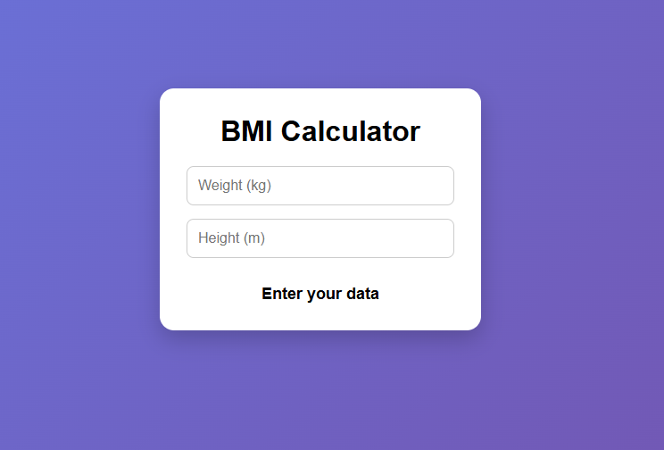

# BMI Calculator

A simple and responsive BMI Calculator built with HTML, CSS, and JavaScript.

## 🌐 Live Demo

👉 https://username.github.io/BMI-Calculator/

## 📸 Preview

## 🚀 Features

* Live BMI calculation
* Instant feedback
* Responsive design
* Clean and modern UI

## 🛠️ Technologies Used

* HTML5
* CSS3
* JavaScript (Vanilla)

## 📂 Project Structure

project/
│── index.html
│── style.css
│── script.js
│── screenshot.png

## ▶️ How to Run Locally

1. Clone the repository
2. Open index.html in your browser
